# Agent Monitor — 本地 Daemon 架构说明书

> v1 | 2026-06-10 | 本地闭环采集 + Web 看板

---

## 1. 系统概述

**通信流向：**

```
Agent Hook ──agent-monitor-hook──▶ events.jsonl ──fsnotify──▶ Daemon ──WS──▶ 浏览器 (localhost:9101)
```

**核心设计：**

| 原则 | 说明 |
|------|------|
| Hook 写文件 | agent-monitor-hook 二进制 → 构造合法 JSON → `events.jsonl` |
| Session 创建 | 只有 Hook 事件创建 session。PID Scanner 仅增强 + 检测死亡 |
| PID 关联 | Hook 事件自带 PID，直接绑定 session。PID Scanner 仅对已绑定 PID 的 session 更新资源/检测死亡 |
| Fail-Open | Daemon 不在时事件不丢（文件持久化），agent 不受影响 |
| 字段兼容 | SessionKey = `hex(SHA256(user_id\|device_id\|agent_type\|agent_session_id))[:16]`，v2 不变 |

---

## 2. 模块架构

```
Agent Hook                  ┌─ Daemon ────────────────────────────────────┐
  │                         │                                              │
  │  agent-monitor-hook     │  EventWatcher ──Event──▶ SessionManager     │
  │  events.jsonl           │  (fsnotify)                │                 │
  │                         │                            │                 │
  ▼                         │  PID Scanner ──ProcessInfo─┤                 │
  ~/.agent-monitor/         │  (15s)        ──死亡检测──▶│                 │
  ├── events.jsonl          │                            │                 │
  ├── local-token           │  Terminal Detector         │                 │
  └── device-id             │                            ▼                 │
                            │                    WebSocket Hub             │
                            │                         │                   │
                            │  Session Recovery ──Session─┘               │
                            │  (启动时)                                    │
                            │                                              │
                            │  HTTP: /api/sessions /health /ws /           │
                            └──────────────────────────────────────────────┘
                                                 │
                                                 ▼
                                            浏览器看板
```

**模块职责：**

| 模块 | 职责 |
|------|------|
| EventWatcher | fsnotify 监听 `events.jsonl`，解析 JSON，验证 token，产出 Event |
| Session Manager | 维护 `map[SessionKey]*Session`。创建 session（Hook）、更新字段、生成 Delta |
| PID Scanner | 15s gopsutil 扫描。已绑定 PID 的 session 更新 CPU/Memory。检测死亡 → disappeared。检测静默 → idle。新 PID 忽略等 hook |
| Terminal Detector | PPID 链上溯 (≤10层) 识别终端 |
| Session Recovery | 启动时扫描 transcript JSONL 恢复最近 24h session |
| WebSocket Hub | 管理 WS 连接。新连接推 Snapshot，实时广播 Delta |

---

## 3. 数据存储

**daemon_sessions 表（SQLite，可选）：**

```sql
CREATE TABLE daemon_sessions (
    user_id          TEXT NOT NULL,        -- v1: "local"
    device_id        TEXT NOT NULL,        -- UUID v4
    agent_type       TEXT NOT NULL,        -- opencode/codex/claude
    agent_session_id TEXT NOT NULL,        -- agent 原生 session id
    session_key      TEXT NOT NULL,        -- hex(SHA256(四字段))[:16]
    pid              INTEGER DEFAULT 0,
    terminal         TEXT DEFAULT '',
    cwd              TEXT DEFAULT '',
    status           TEXT DEFAULT 'active',
    start_time_ms    INTEGER NOT NULL,     -- Unix 毫秒
    last_event_time_ms INTEGER DEFAULT 0,
    last_event_type  TEXT DEFAULT '',
    last_file        TEXT DEFAULT '',
    last_command     TEXT DEFAULT '',
    memory_mb        REAL DEFAULT 0,
    cpu_percent      REAL DEFAULT 0,
    turn_count       INTEGER DEFAULT 0,
    git_branch       TEXT DEFAULT '',
    created_at       INTEGER NOT NULL,
    updated_at       INTEGER NOT NULL,
    ended_at         INTEGER,

    PRIMARY KEY (user_id, device_id, agent_type, agent_session_id)
);
```

**本地文件：**

| 文件 | 内容 | 权限 |
|------|------|------|
| `~/.agent-monitor/device-id` | UUID v4 | 0600 |
| `~/.agent-monitor/local-token` | 256bit Base64 | 0600 |
| `~/.agent-monitor/events.jsonl` | Hook 事件缓冲 | 0600 |
| `~/.agent-monitor/events.offset` | 消费偏移量 (int64) | 0600 |
| `~/.agent-monitor/daemon.db` | SQLite (可选) | 0600 |

---

## 4. 核心数据结构

**SessionKey：**

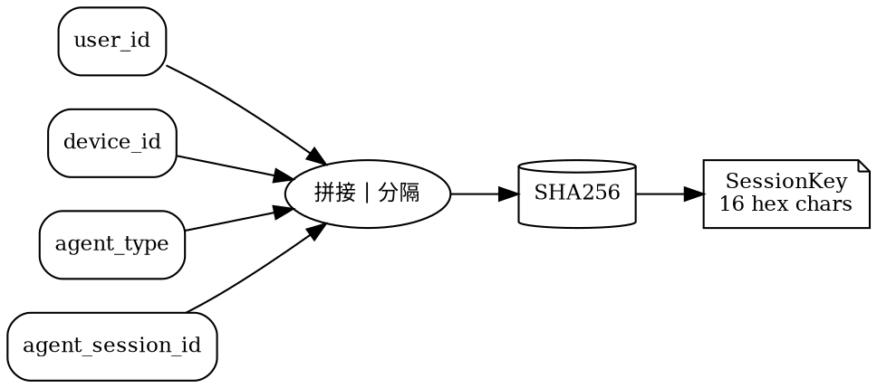

> CWD 不在 SessionKey 中。agent 切换工作目录时不产生新 session。CWD 作为可变字段由 PID Scanner 更新。

**Session 字段分组：**

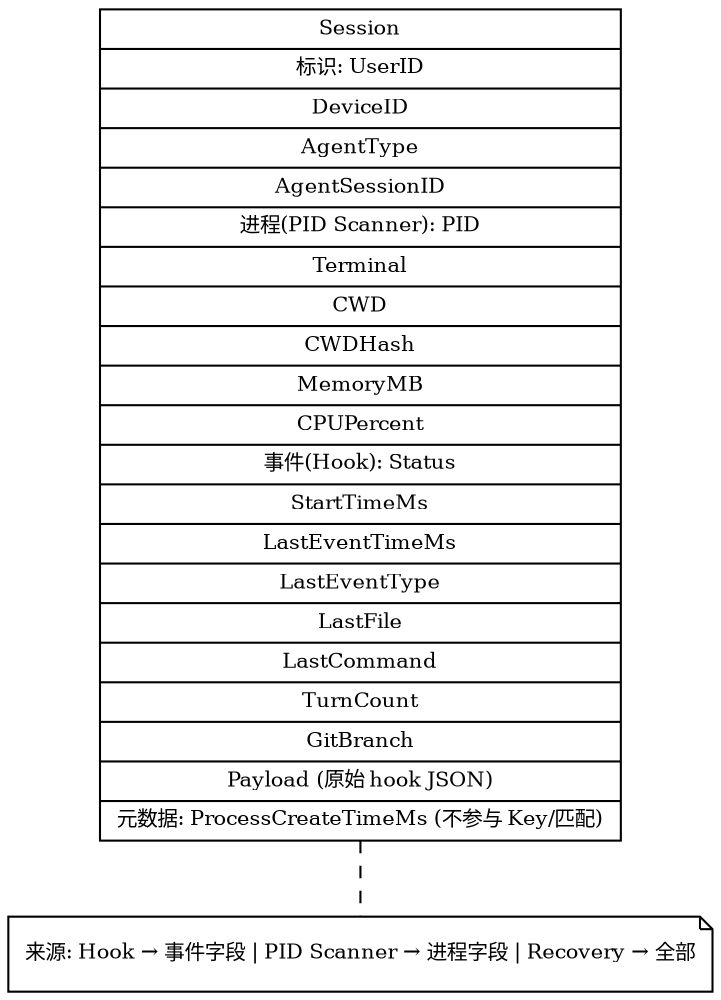

**EventType 映射：**

| Hook 事件名 | EventType |
|------------|-----------|
| SessionStart | session_start |
| UserPromptSubmit | user_prompt |
| PreToolUse | pre_tool_use |
| PostToolUse | post_tool_use |
| Stop | session_end |
| Notification | notification |

**内部数据流：**

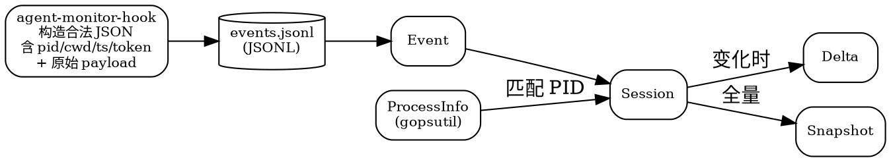

---

## 5. 模块详解

### 5.1 Daemon Token

**生成：** 首次启动时 256bit 随机 → Base64 → `~/.agent-monitor/local-token` (0600)

**验证（EventWatcher 每行 JSON）：**

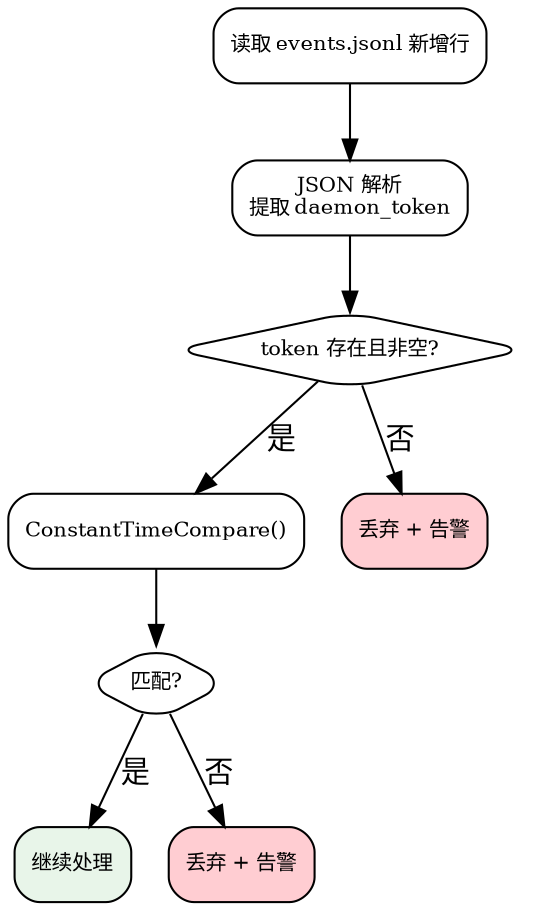

**Hook 命令模板：**

```bash
agent-monitor-hook --agent-type opencode --session-id "$SESSION_ID" --event "PostToolUse" --daemon-token "$(cat ~/.agent-monitor/local-token)"
```

**agent-monitor-hook 职责：**

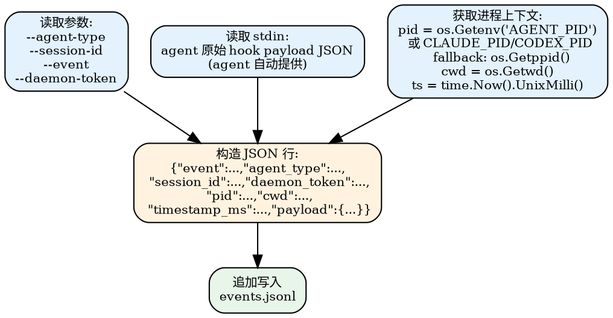

**为什么不用 shell echo：** shell 变量直接拼 JSON 会因双引号、反斜杠、换行等特殊字符产生非法 JSON。helper 二进制用 `encoding/json` 库保证输出合法。agent 提供的原始 payload 通过 stdin 传入，helper 将其完整嵌入 `payload` 字段中。pid/cwd/timestamp 在 helper 内部通过系统调用获取，无需 shell 变量。

### 5.2 EventWatcher

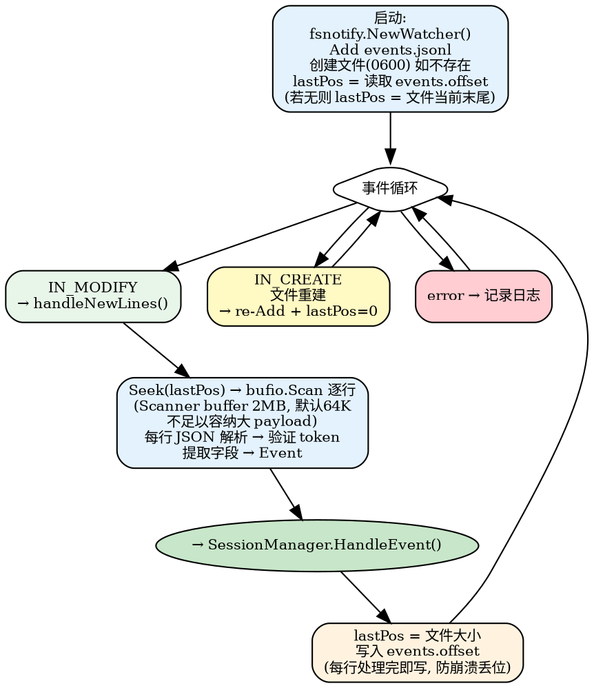

**持久化消费位点（解决离线丢事件）：**

```
每行处理流程:
  ① Seek(lastPos) → 从上次位点开始读
  ② bufio.Scanner 逐行读取 → 跳过空行
  ③ 对每个完整 \n 结尾的行:
     a. JSON 解析 → 验证 token → 归一化
     b. SessionManager.HandleEvent()
     c. offset = 此行在文件中的字节结束位置 (\n 之后)
     d. 原子写 events.offset ← offset
  ④ 文件不以 \n 结尾 → 最后一行未写完 → offset 保持在上一完整行末
     下次启动时重读完整行（写入方最终会补 \n）

启动恢复:
  events.offset 存在 → lastPos = 读取 events.offset
  events.offset 不存在 → lastPos = 文件当前末尾
```

**events.jsonl 每行格式：**

| 字段 | 必需 | 来源 |
|------|------|------|
| event | 是 | `--event` 参数 |
| agent_type | 是 | `--agent-type` 参数 |
| session_id | 是 | `--session-id` 参数 |
| daemon_token | 是 | 由 helper 从文件读取 |
| pid | 是 | `os.Getenv("AGENT_PID")` 或 agent 专属变量（CLAUDE_PID/CODEX_PID），fallback `os.Getppid()` |
| cwd | 是 | `os.Getwd()` |
| timestamp_ms | 是 | `time.Now().UnixMilli()` |
| payload | 是 | agent 原始 hook JSON (stdin → json.RawMessage) |

### 5.3 Session Manager

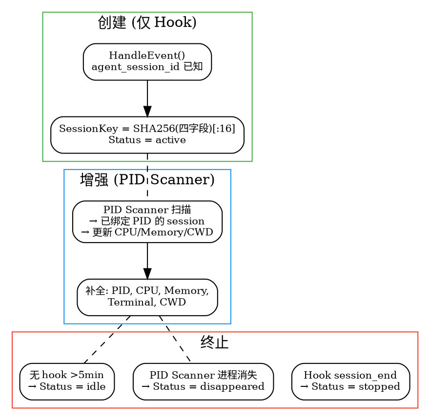

| 触发 | 更新字段 |
|------|---------|
| Hook session_start | Status→active, StartTimeMs, CWD, LastEventTimeMs, LastEventType |
| Hook user_prompt | LastEventTimeMs, LastEventType, TurnCount++ |
| Hook pre_tool_use | LastEventTimeMs, LastEventType |
| Hook post_tool_use | LastEventTimeMs, LastEventType, LastFile, LastCommand |
| Hook tool_result | LastEventTimeMs, LastEventType |
| Hook notification | LastEventTimeMs, LastEventType |
| Hook session_end | Status→stopped, LastEventTimeMs, LastEventType |
| PID alive=true | PID, MemoryMB, CPUPercent, Terminal, CWD |
| PID alive=false | Status→disappeared |
| PID CheckIdle | Status→idle (条件: 无 hook >5min) |

**Delta:** 仅含实际变化字段。无变化不生成。

### 5.4 PID Scanner (15s)

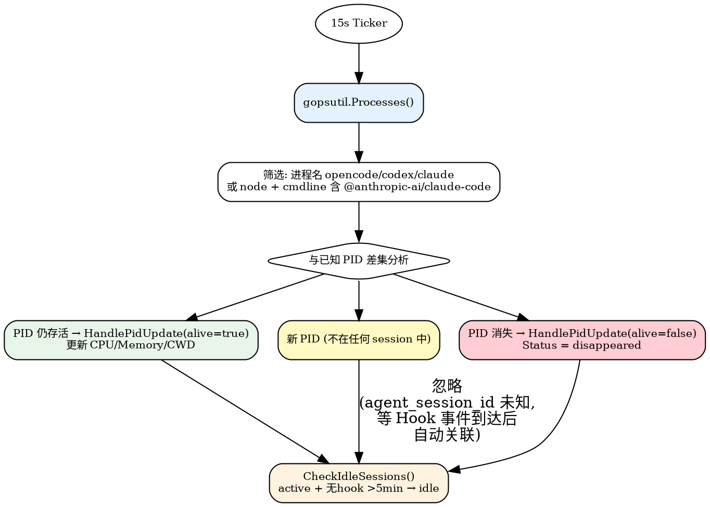

**新 PID 处理：** PID Scanner 无法获取 agent_session_id，因此不能匹配已有 session。新 PID 仅记录日志，不创建 session。当 Hook 事件到达时（携带 agent_session_id + PID），SessionManager 自动创建/更新 session 并绑定 PID。下一次 PID Scanner 扫描时该 PID 已变为"已知 PID"，走 alive 分支更新资源。

### 5.5 Terminal Detector

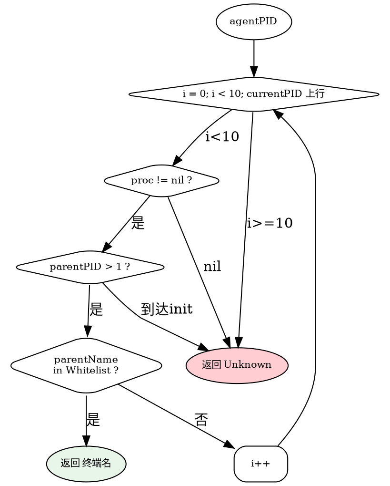

**白名单:** Ghostty, iTerm2, Terminal, Warp, kitty, Alacritty, wezterm-gui, code/Code (VS Code), Cursor, hyper

### 5.6 Session Recovery

启动时扫描 transcript JSONL，恢复最近 24h session，状态 = unknown。

| Agent | Transcript 路径 |
|-------|----------------|
| OpenCode | `~/.config/opencode/sessions/*.jsonl` |
| Claude Code | `~/.claude/projects/*/*.jsonl` |
| Codex | `~/.codex/sessions/**/rollout-*.jsonl` |

**恢复后立即匹配进程：** 恢复完成后触发一次 gopsutil 全量扫描。对每个恢复的 session，用 `(agent_type, agent_session_id)` 匹配运行中进程（从进程 CWD 计算 cwd_hash，与 transcript 中的 cwd_hash 对比）。匹配成功 → 绑定 PID + Status→active。不匹配 → 保持 unknown。

### 5.7 WebSocket Hub

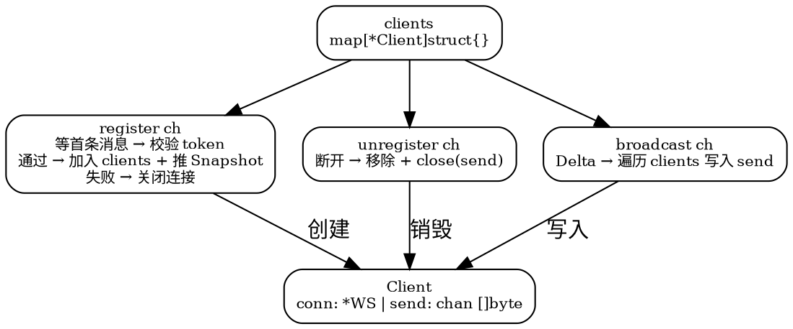

心跳 30s pong，写超时 10s，send buffer 满自动断开。

---

## 6. HTTP API

Daemon 监听 `127.0.0.1:9101`。除 `/`（看板页面）外，全部端点需鉴权。

**鉴权方式：** 请求头携带 `X-Daemon-Token`，值与 `~/.agent-monitor/local-token` 一致。常量时间比较。不匹配返回 `403`。

| 方法 | 路径 | 鉴权 | 说明 |
|------|------|------|------|
| GET | `/api/sessions` | X-Daemon-Token | 全部 session JSON 数组 |
| GET | `/api/sessions/:key` | X-Daemon-Token | 单个 session 详情 |
| GET | `/health` | X-Daemon-Token | 版本、运行时间、session 数量 |
| GET | `/ws` | WS 首条消息携 token | WebSocket 升级 (见下方) |
| GET | `/` | 无 | 看板静态页面 |

**为什么 `/` 无需鉴权：** 看板页面本身不含敏感数据（仅为 HTML/JS 框架），真实数据通过 `/ws` 下发，WS 连接已做鉴权。

---

## 7. WebSocket 协议

```
ws://localhost:9101/ws

连接 → 客户端首条消息携带 token:
{"type":"auth","token":"<daemon_token>"}

服务端校验 → 通过则推 Snapshot:
{"type":"auth_ok"}
{"type":"snapshot","sessions":[...],"gen_time_ms":...}

校验失败:
{"type":"auth_error"}

后续实时推送:
{"type":"delta","session_key":"...","changes":{...},"timestamp_ms":...}
{"type":"session_added","session":{...}}
{"type":"session_removed","session_key":"..."}
{"type":"pong"}
```

**前端行为：** 连接后首条发 auth。收到 auth_ok 后开始处理数据。snapshot 全量渲染。delta 局部 DOM 更新。pong 忽略。

**安全说明：** 看板页面从 localStorage 读取 token（用户首次在页面输入 token 后持久化）。Token 值来自 `~/.agent-monitor/local-token`。同机其他用户因 0600 权限无法读取 token 文件，无法通过 API/WS 鉴权。

---

## 8. Session 状态机

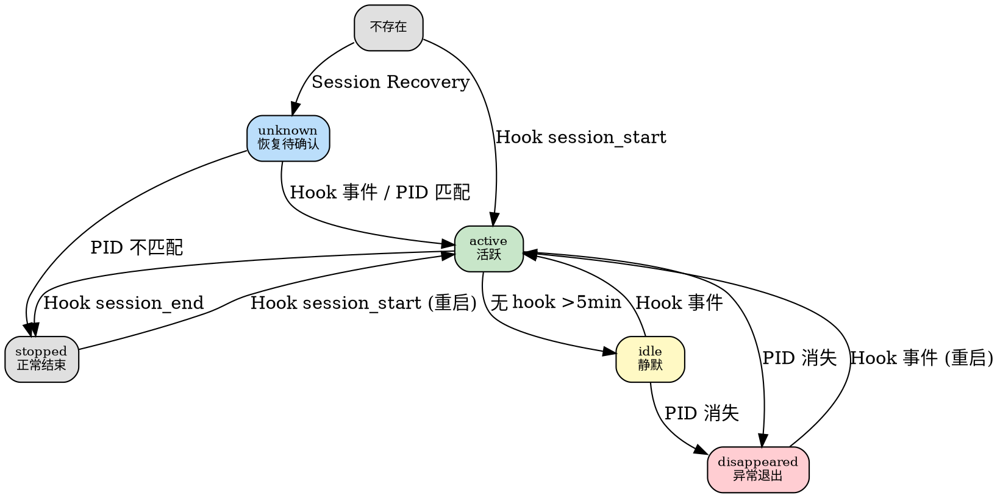

---

## 9. 部署

```bash
go build -o agent-monitor-daemon ./cmd/daemon
./agent-monitor-daemon --listen 127.0.0.1:9101 --scan-interval 15
```

| 参数 | 默认 | 说明 |
|------|------|------|
| `--listen` | `127.0.0.1:9101` | HTTP 监听 |
| `--scan-interval` | `15` | PID 扫描间隔(秒) |
| `--user-id` | `"local"` | 用户标识 |

**项目结构：**

```
agent-monitor/
├── cmd/daemon/main.go      # Daemon 入口
├── cmd/hook/main.go         # agent-monitor-hook (Hook 辅助二进制)
├── internal/
│   ├── hook/                # EventWatcher + parser
│   ├── session/             # SessionManager + types + recovery
│   ├── scanner/             # PID Scanner + Terminal Detector
│   ├── server/              # HTTP handler + WebSocket Hub
│   └── token/               # DaemonToken
├── web/dashboard.html       # 本地看板
└── cmd/setup/main.go        # agent-monitor-setup CLI
```

**验证：**

```bash
# 启动 Daemon
./agent-monitor-daemon --listen 127.0.0.1:9101

# 模拟 hook 事件
echo '{"tool":"read","input":{"filePath":"/tmp/test.txt"}}' | \
  agent-monitor-hook --agent-type opencode --session-id "test-session-001" --event "PostToolUse" --daemon-token "$(cat ~/.agent-monitor/local-token)"

# 查看结果 (需 token)
TOKEN=$(cat ~/.agent-monitor/local-token)
curl -H "X-Daemon-Token: $TOKEN" http://127.0.0.1:9101/api/sessions
open http://127.0.0.1:9101

# 验证离线恢复
killall agent-monitor-daemon
echo '{"tool":"edit","input":{"filePath":"/tmp/test2.txt"}}' | \
  agent-monitor-hook --agent-type opencode --session-id "test-session-001" --event "PostToolUse" --daemon-token "$(cat ~/.agent-monitor/local-token)"
./agent-monitor-daemon --listen 127.0.0.1:9101
# → 从 events.offset 恢复消费，离线期间事件被追上
```
