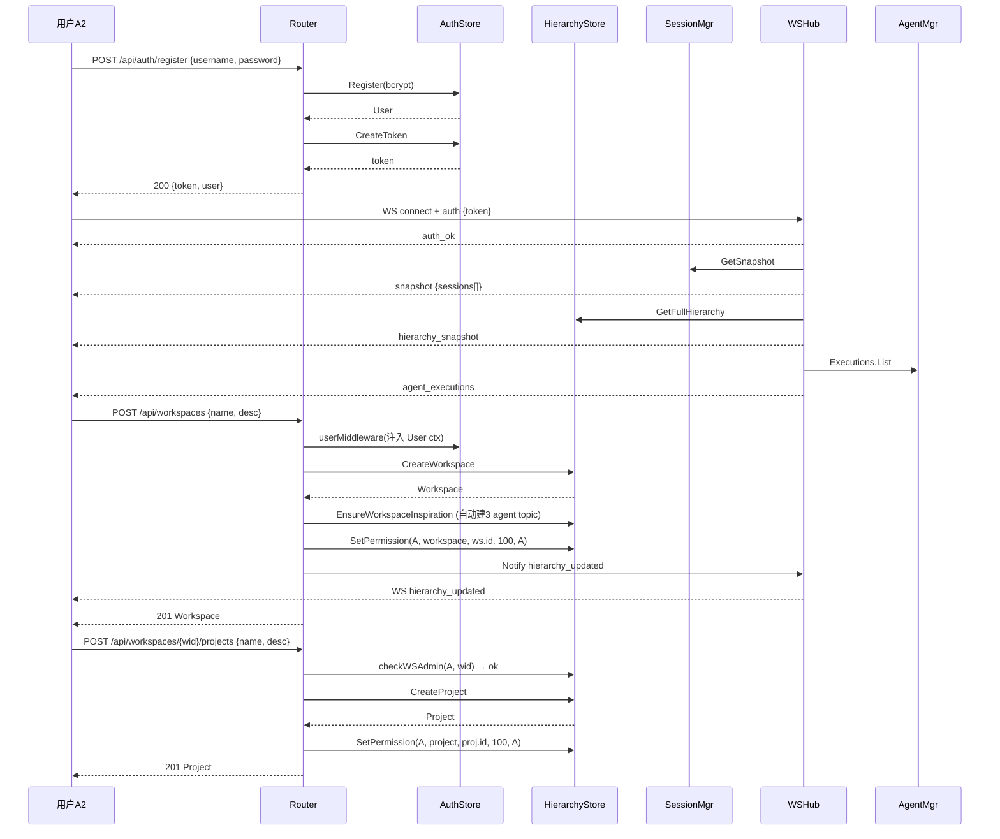
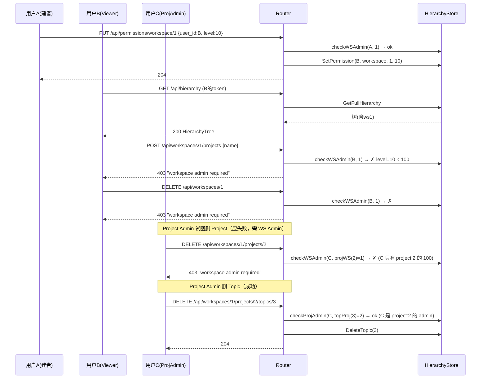
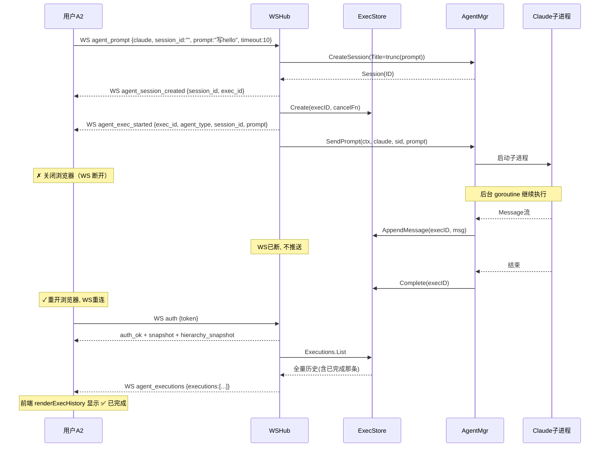
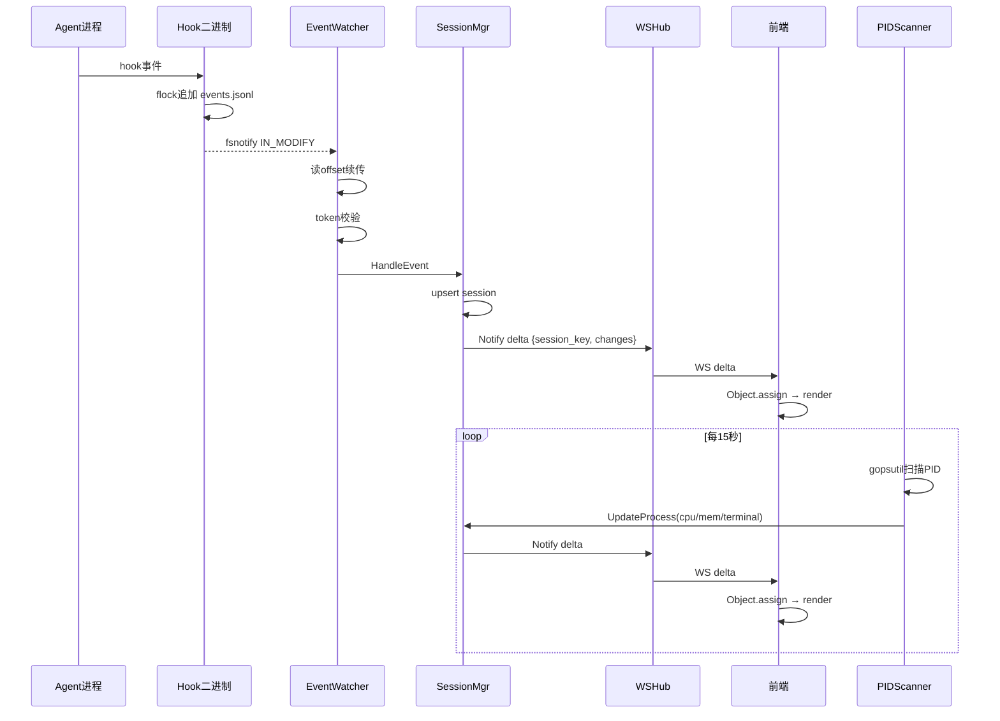
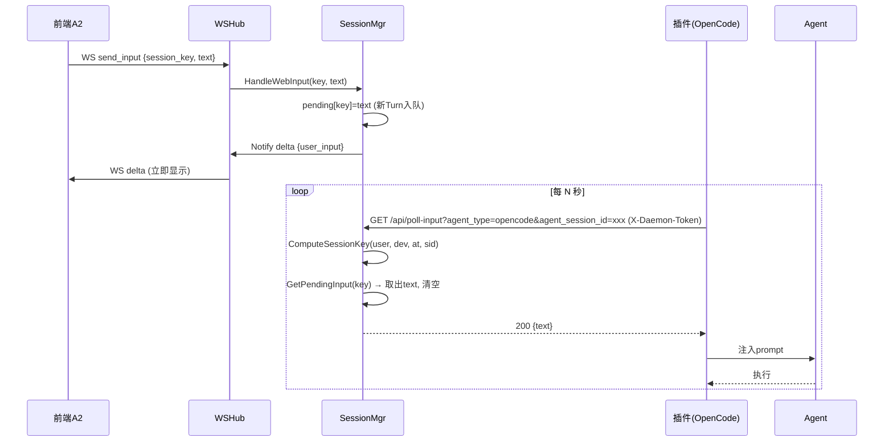
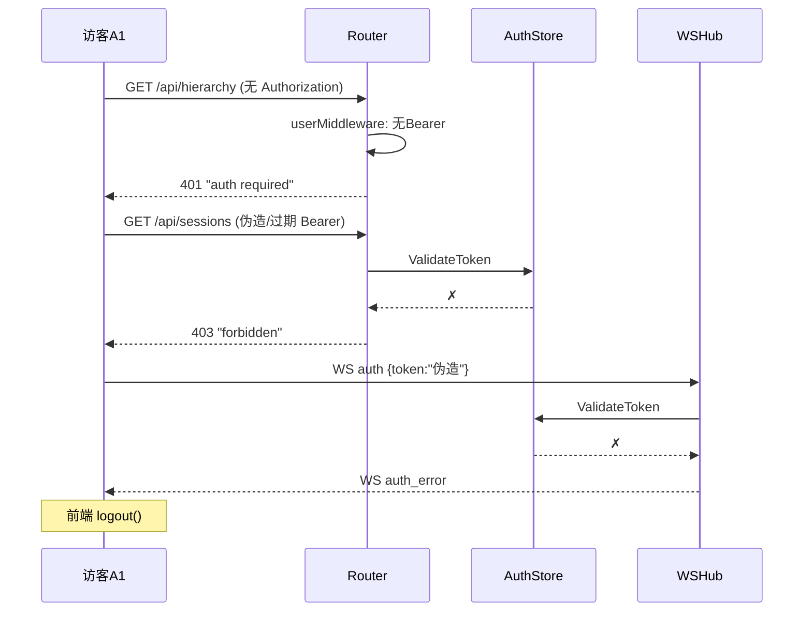
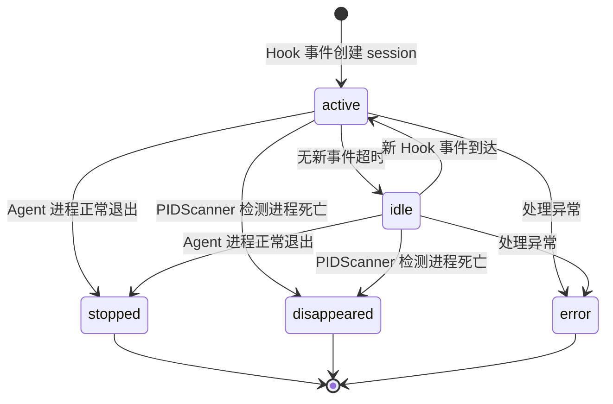
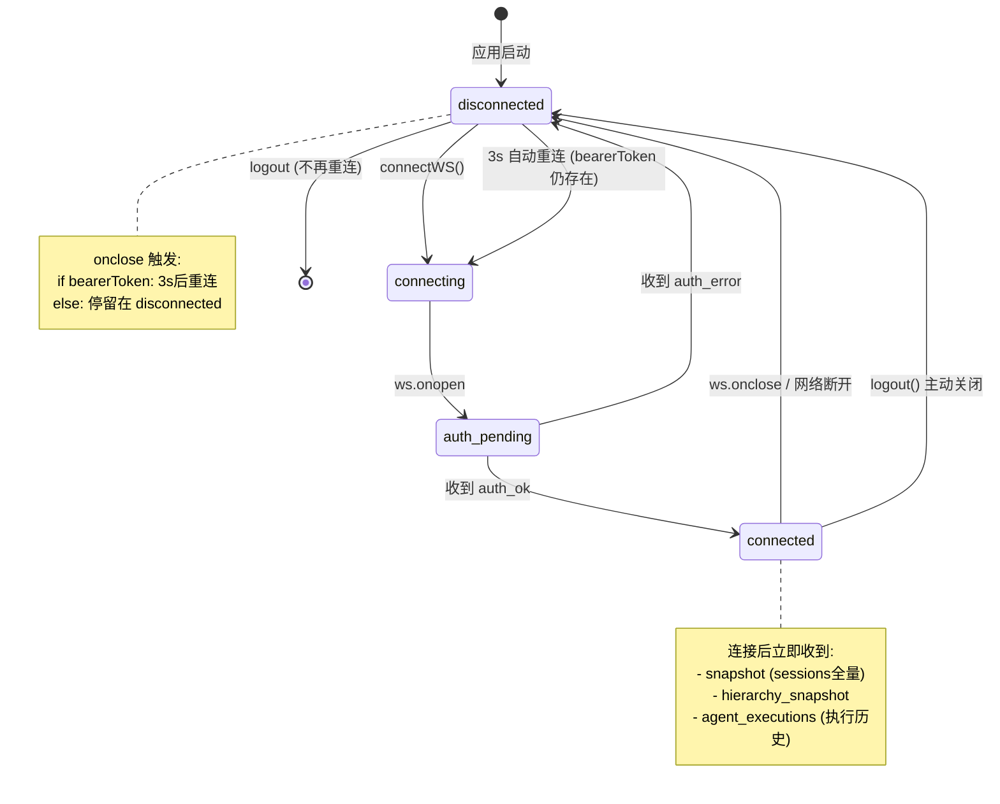
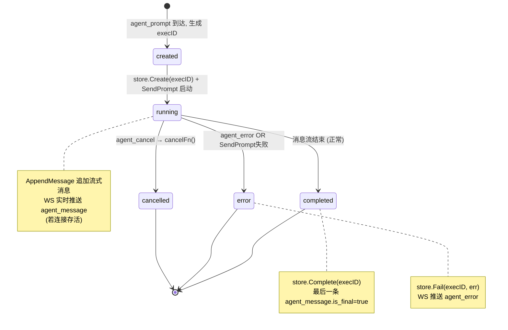
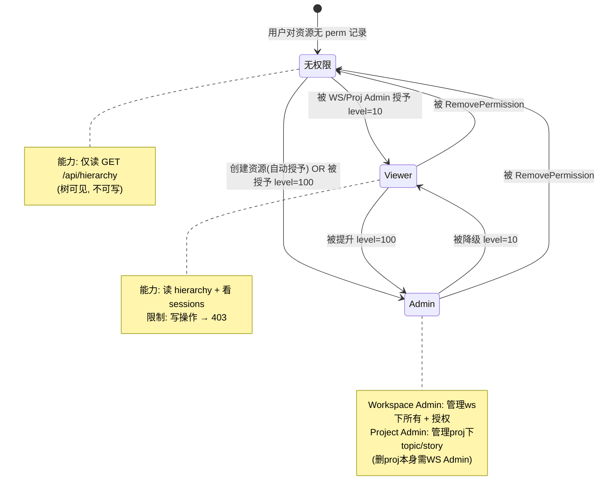

# Agent Monitor — 前后分离执行方案

> v1 | 2026-06-18 | 将单文件 dashboard.html 迁移为独立 Vue 3 SPA，与 Go daemon 完全分离部署

配套文档：
- API 交互分析：`docs/api-analysis.md`
- 测试用例：`docs/test-cases.md`

---

## 0. 决策摘要

| 决策项 | 选定方案 | 理由 |
|--------|---------|------|
| 前端技术栈 | Vite + Vue 3 + TypeScript | 模板语法对原生 HTML 迁移友好，类型安全，生态成熟 |
| 部署模式 | 完全独立部署（静态主机 + Go API 分离） | 真正物理分离，符合"完全前后分离"目标 |
| Agent 控制接口 | 统一走 WebSocket | 已有重连恢复 + 执行历史持久化，零迁移成本 |
| 改造范围 | 1:1 迁移现有功能 | 风险最小，先验证分离架构，缺失 CRUD 后续再补 |
| 状态管理 | Pinia 集中 store | 按领域拆 store，WebSocket 消息集中分发，可测试 |
| 迁移策略 | 单页整体迁移 | 单页应用天然适合整体迁移，避免长期双版本维护 |

---

## 1. 整体拓扑

### 1.1 开发态

```
Vite dev server (:5173) ──proxy──▶ Go daemon (:9101)
  /api/*  → 127.0.0.1:9101
  /ws     → 127.0.0.1:9101 (WebSocket proxy)
  免 CORS（同源经代理）
```

- 前端开发者在 `web/frontend/` 下 `npm run dev`，Vite 起本地 5173。
- `vite.config.ts` 配置 `server.proxy`，将 `/api` 和 `/ws` 转发到本地 Go daemon。
- 开发期无需 CORS 中间件（同源经代理）。

### 1.2 生产态

```
静态主机 (Nginx / CDN / 任意静态服务器) ──CORS──▶ Go daemon (:9101, 纯 API + WS)
  前端构建产物 (dist/) 独立部署
  baseURL 由环境变量 VITE_API_BASE 注入
  Go 后端移除 GET / 静态路由, 新增 CORS 中间件
```

- Go 后端不再伺服 HTML，变为纯 API + WS 服务。
- 跨域请求由后端 CORS 中间件处理。
- WS 跨域鉴权沿用首条消息 `auth` 机制（不能用 HTTP Header 鉴权 WS）。

### 1.3 后端必需改动（最小集）

仅服务于"独立部署"目标，不动业务逻辑：

1. **新增 CORS 中间件**（`internal/server/cors.go`）
   - 允许配置的 origin（`--cors-origins` 参数，逗号分隔，默认 `*` 供本地用）
   - 处理 `OPTIONS` 预检请求
   - 允许 `Authorization`、`Content-Type`、`X-Daemon-Token` 头
   - 暴露 WS 升级所需头

2. **移除静态资源路由**
   - 删除 `serveDashboard` 函数（handlers.go:444）
   - 删除 `mux.HandleFunc("GET /", h.serveDashboard)` 注册（handlers.go:32）

3. **新增启动参数**
   - `--cors-origins string`：逗号分隔的允许源列表，默认 `*`

业务路由、WebSocket 协议、鉴权机制全部不变。

---

## 2. 前端项目结构

新建 `web/frontend/`，保留旧 `web/dashboard.html` 直到对等验证通过后删除。

```
web/frontend/
├── package.json
├── vite.config.ts          # proxy /api + /ws → :9101; env 注入 VITE_API_BASE
├── tsconfig.json
├── index.html
└── src/
    ├── main.ts             # createApp + pinia + router(可选,单页可不要)
    ├── App.vue             # 根布局 (sidebar + main)
    ├── api/
    │   ├── client.ts       # fetch 封装: baseURL + Bearer 头 + 错误处理
    │   ├── auth.ts         # register/login/logout
    │   ├── hierarchy.ts    # workspace/project/topic/story CRUD
    │   ├── permissions.ts  # permissions + users
    │   └── types.ts        # 后端类型镜像 (Session/Workspace/Story/Message...)
    ├── ws/
    │   └── manager.ts      # WebSocket 单例: 鉴权/重连/心跳/消息分发
    ├── stores/
    │   ├── auth.ts         # token + user, localStorage 持久化
    │   ├── hierarchy.ts    # 层级树, CRUD 后刷新
    │   ├── sessions.ts     # WS 推送的 sessions map + delta 合并
    │   └── agent.ts        # executionHistory + 流式消息
    ├── composables/
    │   └── useWebSocket.ts # 连接生命周期 + 消息路由到 stores
    ├── components/
    │   ├── AuthOverlay.vue
    │   ├── SidebarTree.vue     # workspace/project/topic/story 树
    │   ├── SessionCard.vue     # 单卡片
    │   ├── Timeline.vue        # turns 时间线
    │   ├── ToolGroup.vue       # 工具组折叠
    │   ├── AgentPanel.vue      # agent 控制面板
    │   ├── PermissionModal.vue
    │   └── CreateModal.vue
    └── styles/
        └── main.css         # 迁移现有内联 CSS
```

### 关键设计

- `api/client.ts` 统一注入 `Authorization: Bearer` 头和 `VITE_API_BASE` 前缀，消除散落的 fetch 拼接。
- `ws/manager.ts` 封装连接/鉴权/重连（保留现有 3s 重连逻辑），消息按 `type` 分发到对应 store。
- `stores/sessions.ts` 复刻现有 `snapshot`/`session_added`/`delta` 合并逻辑（`Object.assign` 增量合并）。
- **修复硬编码 ID**：`hierarchy.ts` 的 createStory/createTopic 接收动态 wid/pid 参数，前端调用处传入当前选中 workspace/project（修复 dashboard.html:576, 768 写死 `wid=1, pid=1` 的问题）。

---

## 3. 数据流与状态管理

### 3.1 数据流

```
WebSocket 消息                  REST 调用
    │                              │
    ▼                              ▼
ws/manager.ts                  api/client.ts
    │ 按type分发                   │ 统一 Bearer + baseURL
    ├─ snapshot/session_added      │
    │  └▶ stores/sessions.ts       ├─ api/hierarchy.ts ─▶ stores/hierarchy.ts
    ├─ delta                       ├─ api/auth.ts      ─▶ stores/auth.ts
    │  └▶ stores/sessions.ts       └─ api/permissions.ts
    ├─ hierarchy_snapshot/updated
    │  └▶ stores/hierarchy.ts
    └─ agent_executions/exec_started/agent_message/...
       └▶ stores/agent.ts
                │
                ▼
           Vue 组件 (computed 订阅 store, 自动响应式渲染)
```

### 3.2 Pinia stores 职责

| Store | 状态 | Actions | 来源 |
|-------|------|---------|------|
| `auth` | token, user | login, register, logout, restoreFromStorage | api/auth.ts + localStorage |
| `hierarchy` | HierarchyTree, selectedWorkspaceId, selectedTopicId, selectedStoryId | refresh, createWorkspace/Project/Topic/Story, editStory, deleteStory | api/hierarchy.ts + WS hierarchy_* |
| `sessions` | `Map<session_key, Session>`, currentFilter | applySnapshot, addSession, applyDelta, filter getter | WS snapshot/session_added/delta |
| `agent` | `executionHistory[]`, currentExecId | sendPrompt, cancel, onExecStarted, onMessage, onExecutions | ws.manager + WS agent_* |

### 3.3 C→S WebSocket 消息

由组件直接调 `ws.manager.send()`：
- `send_input` — SessionCard 输入框
- `agent_prompt` — AgentPanel 发送按钮
- `agent_cancel` — AgentPanel 取消按钮

---

## 4. 组件迁移映射

| 现有 dashboard.html 函数 | → Vue 组件 | 状态来源 |
|------------------------|-----------|---------|
| `renderAuth` / `doLogin`/`doRegister` | `AuthOverlay.vue` | `auth` store |
| `renderTree` / `renderProjectNode` | `SidebarTree.vue` (递归子组件) | `hierarchy` + `sessions` store |
| `renderSessionCard` | `SessionCard.vue` | `sessions` store |
| `renderTimeline` | `Timeline.vue` + `ToolGroup.vue` | session.turns prop |
| Agent 面板 (`sendAgentPrompt`/`cancelAgent`) | `AgentPanel.vue` | `agent` store + ws.manager |
| `showPermissionModal`/`loadPermissions` | `PermissionModal.vue` | api/permissions |
| `showCreateModal`/`doCreate` | `CreateModal.vue` | api/hierarchy |
| `handleMessage` (WS 路由) | `useWebSocket` composable | 分发到各 store |
| `formatPayload`/`formatPayloadDisplay`/`esc`/`trunc` | `utils/format.ts` | 纯函数 |

**视觉一致性**：现有内联 CSS 整体迁到 `styles/main.css`，组件用 scoped 样式或全局类复用，不改视觉设计。

---

## 5. 验证与切换

### 5.1 对等验证清单（1:1 迁移验收标准）

1. 登录/注册/登出流程
2. 层级树渲染 + workspace/project/topic/story 创建
3. 权限弹窗（列表/添加/删除）
4. Session 卡片列表 + 筛选 + 排序
5. 卡片展开 + 时间线 + 工具组折叠 + payload 折叠
6. Web 输入框发送
7. Agent 面板：发 prompt、流式输出、取消、重连恢复执行历史
8. WS 断线 3s 重连

### 5.2 切换步骤

1. 开发期保留 `web/dashboard.html`，Vue 版在 `web/frontend/` 独立开发。
2. 对等验证通过后，删除 `web/dashboard.html` + 后端 `serveDashboard`/`GET /` 路由。
3. `Makefile` 新增：
   - `make web-dev` — 启动 Vite dev server
   - `make web-build` — 构建到 `web/frontend/dist`

### 5.3 测试策略

- 后端：现有 `make test`，新增 CORS 中间件测试。
- 前端：Vitest 测 stores 的 WS 消息处理逻辑（snapshot/delta 合并、agent 状态机）和 api/client 的鉴权头注入；组件渲染测试用 @vue/test-utils。
- 详细用例见 `docs/test-cases.md`。

---

## 6. 用户与服务建模

### 6.1 用户角色（Actor）

| Actor | 凭证 | 可访问范围 | 来源 |
|-------|------|-----------|------|
| **A1 访客** (Anonymous) | 无 | `POST /api/auth/{register,login}` 仅此 | 未登录 |
| **A2 认证用户** (Authenticated) | Bearer token | 所有 `userMiddleware` 路由 + 旧 `authMiddleware` 路由 | 登录后 |
| **A3 Agent 插件** (Plugin) | X-Daemon-Token | `authMiddleware` 路由：`/api/poll-input`、`/api/sessions/*`、`/health` | agent-monitor-hook/插件 |
| **A4 外部 API 调用者** (External) | Bearer token | REST `/api/agent/*` 端点（SSE 流） | 编程控制 agent |

**A2 认证用户按资源权限运行时动态细分**：

| 子角色 | 判定 | 能力 | 限制 |
|--------|------|------|------|
| **A2.x 无权限用户** | 对目标资源无 perm 记录 | 只能读 `GET /api/hierarchy` 看到树，创建 workspace | 不能读写他人资源 |
| **A2.v Viewer** | `level=10` | 读 hierarchy、看 sessions | 写操作被 `checkWSAdmin`/`checkProjAdmin` 拒绝 → 403 |
| **A2.wa Workspace Admin** | 对 workspace `level=100` | 管理 workspace 及其下所有 project/topic/story + 授权他人 | 跨 workspace 无权 |
| **A2.pa Project Admin** | 对 project `level=100` | 管理 project 下 topic/story | 不能删 project 本身（需 workspace admin） |

### 6.2 权限规则

从 handlers.go:129-149 推导：

- 创建 Workspace/Project 时**自动**给创建者授予 Admin（handlers.go:219, 262）。
- 删除 Project 需要 **Workspace Admin**（`checkWSAdmin(h.projWS(id))` @ handlers.go:278）。
- 删除 Topic/Story 需要 **Project Admin**（经 `topProj`/`stoTop` 上溯到 project 再检查）。
- 权限**不继承**：对 workspace 有 admin **不自动**对 project 有 admin（创建 project 时才显式授予）。

### 6.3 服务组件（Service）

```
┌─ HTTP Router (mux) ─────────────────────────────────────────────┐
│  authMiddleware ──┐                       userMiddleware ──┐    │
│  (X-Daemon-Token  │                       (Bearer 强制,     │    │
│   OR Bearer)      │                       注入 User ctx)    │    │
│       │           │                            │           │    │
│  ┌────▼─────┐  ┌──▼─────────┐  ┌──────────────▼───────┐  ┌─▼──┐│
│  │AuthStore │  │SessionMgr  │  │HierarchyStore        │  │Auth││
│  │(用户/    │  │(session状态│  │(4层CRUD + PermTable  │  │Stor││
│  │ bcrypt/  │  │ +pending   │  │ + CheckWSAdmin/      │  │e   ││
│  │ token)   │  │ input队列) │  │ CheckProjAdmin)      │  │    ││
│  └──────────┘  └──────┬─────┘  └──────────────────────┘  └────┘│
│                       │                  │                     │
│                       │ notify           │ notify              │
│                       ▼                  ▼                     │
│                ┌──────────────────────────────┐                │
│                │ WSHub (register/unreg/bcast) │ ◀── /ws         │
│                │ → snapshot/delta/agent_msg   │                 │
│                └──────────────┬───────────────┘                 │
│                               │ SendPrompt/Cancel               │
│                               ▼                                 │
│                ┌──────────────────────────────┐                │
│                │ AgentManager (SDK)           │                │
│                │ ├ ClaudeSDK/OpenCode/Codex   │                │
│                │ └ ExecutionStore (≤500)     │                │
│                └──────────────────────────────┘                │
└────────────────────────────────────────────────────────────────┘
       ▲ hook事件
       │
  EventWatcher (fsnotify events.jsonl) ── PIDScanner (15s gopsutil)
  / Agent 插件轮询 /api/poll-input ◀── pending input 队列
```

---

## 7. 时序图

### 7.1 时序 1：新用户首次完整使用（happy path）



**关键不变量**：
- 创建后立即有 admin 权限（无需二次授权）。
- Inspiration workspace 自动建 3 个 agent topic。
- hierarchy_updated 推送给所有在线客户端。

---

### 7.2 时序 2：多用户权限协作与边界拒绝



**关键边界**：
- Project Admin 不能删 Project 本身（需 Workspace Admin）。
- Project Admin 可删其 Project 下的 Topic/Story。
- 权限不继承：对 workspace 有 admin 不自动对 project 有 admin。

---

### 7.3 时序 3：Agent 控制执行 + 关浏览器 + 重连恢复



**关键不变量**：
- 执行与 WS 连接解耦，ExecutionStore 是执行真相源。
- 重连后 `Executions.List()` 恢复全部历史。
- 同一 session 支持多个并发执行（各自独立 execID）。

---

### 7.4 时序 4：Session 实时监控闭环（多源汇聚）



**关键不变量**：
- Hook 事件和 PIDScanner 都会触发 delta，前端 `Object.assign` 合并必须幂等。
- 后端 delta 推送需并发安全（已有 writeMu 保护）。

---

### 7.5 时序 5：Web 输入注入闭环（前端 → 插件轮询 → agent）



**关键不变量**：
- pending input 取走即清（一次性）。
- 插件用 X-Daemon-Token 鉴权，前端用 Bearer 经 WS。

---

### 7.6 时序 6：鉴权失败与 token 失效



---

## 8. 状态图

### 8.1 Session 状态机（后端 SessionManager）

来源：session/types.go:12-19 + README 状态机说明。



**触发源**：
- `active ↔ idle`：Hook 事件 / 超时
- `→ stopped`：Agent 正常退出
- `→ disappeared`：PIDScanner 15s 扫描发现 PID 不存在
- `→ error`：事件处理异常

**并发安全**：状态转换由 SessionManager 内部锁保护；delta 推送带 writeMu。

---

### 8.2 WebSocket 连接状态机（前端 ws/manager.ts）

来源：dashboard.html:327-333 现有逻辑 + 前后分离后复刻。



**关键不变量**：
- 仅在 `connected` 状态处理业务消息（snapshot/delta/agent_*）。
- 仅在 `connected` 状态允许 `ws.send()` 业务消息。
- 重连后通过 snapshot + agent_executions 恢复全状态，不依赖增量。
- logout 时清 token 并设标志，阻止重连。

---

### 8.3 Execution 状态机（后端 ExecutionStore + 前端 agent store）

来源：sdk/execution.go + websocket.go handleAgentPrompt。



**持久化与上限**：
- ExecutionStore 内存保存，上限 500 条 FIFO，超出逐出最旧。
- 重连时 `Executions.List()` 返回全部历史，前端替换 executionHistory。
- 状态转换由 ExecutionStore 内部锁保护。

---

### 8.4 权限状态图（用户对单个资源的有效权限）



**权限不继承原则**：对 workspace 有 Admin 不自动对 project 有 Admin，需创建 project 时显式授予或被授权。

---

## 9. 实施阶段划分

| 阶段 | 内容 | 产出 | 验收 |
|------|------|------|------|
| P0 | 后端 CORS 中间件 + 移除静态路由 + `--cors-origins` 参数 | Go 改动 | DEP-01, DEP-02, DEP-04, DEP-06, DEP-07 |
| P1 | 前端项目脚手架 + api/client + ws/manager + auth store | 可登录的空壳 | AUTH-01~13, WS-01~07 |
| P2 | hierarchy store + SidebarTree + CreateModal + PermissionModal | 侧边栏可用 | HIER-01~16, PERM-01~08 |
| P3 | sessions store + SessionCard + Timeline + ToolGroup | 卡片列表可用 | SESS-01~08, TL-01~07 |
| P4 | agent store + AgentPanel + 执行历史 | Agent 控制可用 | AG-01~18, IN-01~07 |
| P5 | 对等验证 + 删除旧 dashboard.html + Makefile 集成 | 完全分离 | 全部用例回归 + DEP-03, DEP-05, DEP-08 |

每阶段对应测试用例见 `docs/test-cases.md`，建议按阶段先写测试再实现。
